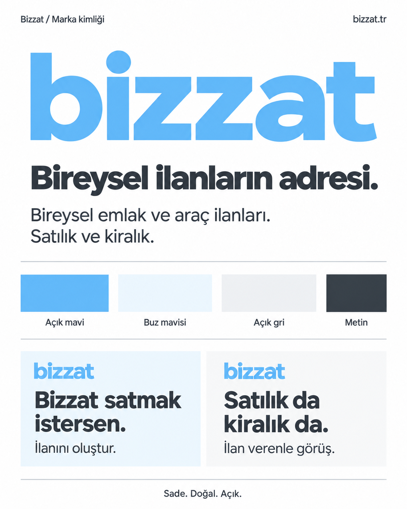

# Bizzat — Tasarım bağlamı

**Durum:** Görsel yön kullanıcı tarafından onaylandı. Slogan daha sonra onaylanan konumlandırmaya göre güncellendi.

## Tasarım tercihi

Kullanıcı tasarımın sade, profesyonel ve az detaylı olmasını istiyor. Açık renkler özellikle tercih ediliyor. Gösterişli, süslü veya yapay biçimde üretilmiş izlenimi veren bir kimlik istenmiyor.

Görsel panodaki logo, renk yönü, harf ağırlığı ve genel görünüm beğenildi. Bunlar projenin görsel referansıdır; yeni bir gerekçe veya kullanıcı yönlendirmesi olmadan farklı bir estetik yön varsayılmamalıdır.

## Logo

- Yazı logosu: küçük harflerle `bizzat`.
- Ana renk: açık mavi.
- Kalın, okunaklı, sade harfler.
- Panodaki harf biçimi ve oranlar referanstır.
- Logoya ayrıca bir ev, araç, anahtar veya benzeri sembol ekleme kararı yoktur.
- Metin içinde marka adı `Bizzat` olarak yazılır.
- Alan adı `bizzat.tr`, adresin görünmesi gereken iletişimlerde kullanılır; marka adının ayrılmaz parçası değildir.

## Renk referansları

| Renk | Başlangıç referansı | Rol |
|---|---|---|
| Açık mavi | `#66B7F2` | Yazı logosu ve marka vurgusu |
| Buz mavisi | `#EFF7FD` | Açık yardımcı alanlar |
| Beyaz | `#FFFFFF` | Ana zemin |
| Açık gri | `#F4F5F6` | İkincil alanlar |
| Koyu gri | `#30383F` | Okunaklı metin |

Bu kodlar, görselin hazırlanmasında kullanılan başlangıç renk referanslarıdır; görseldeki bütün piksellerin ölçülmüş değerleri değildir. Uygulamaya geçilirken renkler tutarlı değerlerle tanımlanmalı ve gerçek metin/zemin eşleşmeleri okunabilirlik açısından değerlendirilmelidir. Henüz bir erişilebilirlik uygunluk testi yapılmadı.

## Düzen ve görsel dil

- Beyaz ve açık tonlar geniş alanlarda kullanılır.
- Yazılar koyu griyle rahat okunur.
- Açık mavi marka karakterini taşır; koyu yüzeyler tasarımın ana görünümü değildir.
- Boşluklar, net başlıklar ve sınırlı sayıda detay düzeni sağlar.
- Süsleme amacıyla gradyan, parlama, üç boyutlu efekt veya karmaşık sembol eklenmez.
- Genel görünüm onaylanan panoya dayanır. İlk ana sayfa görsel taslağı [HOMEPAGE.md](docs/design/HOMEPAGE.md) dosyasında bulunur; ekran taslağı henüz onaylanmadı ve uygulama kodu hazırlanmadı.

## Ekranların işleyişi

Kullanıcının kararıyla ana sayfa, ilan listesi ve ilan detayı için Sahibinden esas alınacak. Filtreler ilgili emlak ve araç kategorileriyle birebir aynı olacak; ilan verme adımları da benzer olacak.

Bu alanlar için ayrıca yeni akışlar veya filtre alternatifleri üretmek istenmiyor. Yapılacak tasarım işi, referansın Bizzat'ın açık mavi görsel kimliği ve “sen” diliyle uygulanmasıdır. Sahibinden'e ait bir ekran veya ayrıntılı filtre envanteri henüz bu depoya aktarılmadı.

İlk ana sayfa önizlemesi statik bir görseldir. Canlı Sahibinden ana sayfasına erişilemediği için güncel yerleşimin birebir eşleştiği iddia edilmez. Örnek ilanlar ve fiyatlar tasarım amaçlıdır.

## Metinler

| Kullanım | Metin |
|---|---|
| Ana slogan | Bireysel ilanların adresi. |
| Açıklama | Bireysel emlak ve araç ilanları. |
| Kapsam | Satılık ve kiralık. |
| Satış reklamı | Bizzat satmak istersen. |
| İlan çağrısı | İlanını oluştur. |
| Satış ve kiralama reklamı | Satılık da kiralık da. |
| İletişim çağrısı | İlan verenle görüş. |

Kullanıcıya “sen” diye hitap edilir. Ayrıntılı dil kuralları [VOICE.md](docs/brand/VOICE.md) dosyasındadır.

## Üretim durumu

Mevcut pano raster bir marka referansıdır. Düzenlenebilir vektör logo, ayrı logo dosyaları, favicon, kesin font ailesi ve font lisansı henüz hazırlanıp seçilmedi. Panodaki yazı karakterine belirli bir ticari font adı atfedilmemelidir.

Yeni üretim dosyaları hazırlanırken onaylanan görünüm esas alınmalıdır; font veya teknoloji seçilmiş gibi varsayım yapılmamalıdır.
