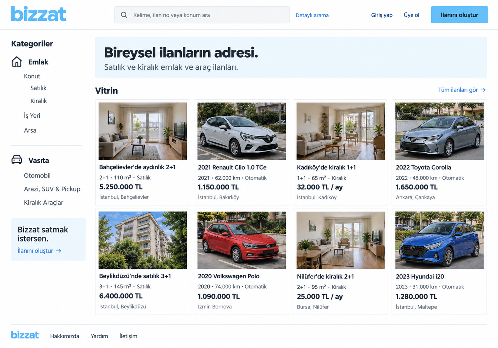

# Ana sayfa — İlk görsel taslak

**Tarih:** 6 Eylül 2026  
**Durum:** Kullanıcıya sunulan ilk ekran taslağı; ekranın kendisi henüz onaylanmadı.  
**Tür:** Statik PNG görsel; çalışan site veya etkileşimli prototip değildir.

## Taslağın dayanağı

Kullanıcı, Sahibinden'i ana sayfa, ilan listesi ve ilan detayı için esas almayı; filtreleri ilgili kategorilerle birebir aynı yapmayı; ilan verme adımlarını benzer tutmayı kararlaştırdı. Bu görsel, söz konusu yaklaşımı Bizzat'ın onaylanan açık mavi kimliğiyle göstermeyi amaçlar.

Sahibinden'in canlı ana sayfası bu çalışma sırasında 403 yanıtı verdi. Arama sonuçları güncel sayfa yerleşiminin birebir doğrulanmasına yeterli olmadı. Dolayısıyla bu taslak, güncel Sahibinden ekranının doğrulanmış bir kopyası veya tamamlanmış filtre envanteri değildir.

## Görseldeki düzen

- Üstte Bizzat logosu, arama alanı, detaylı arama bağlantısı, giriş/kayıt bağlantıları ve “İlanını oluştur” çağrısı.
- Solda emlak ve vasıta kategorileri ile örnek alt kategoriler.
- Ana alanda kısa bir marka açıklaması ve iki sırada toplam sekiz örnek ilan.
- İlanlarda fotoğraf, başlık, temel özellikler, fiyat ve konum.
- Beyaz ve açık mavi zeminler, koyu gri yazılar ve ölçülü ayırıcılar.

Görseldeki kategoriler, örnekler ve vitrin düzeni ekranı değerlendirmek içindir. İlk yayın kapsamı, ücretli öne çıkarma veya iletişim kanalı hakkında yeni karar alınmadı.

## Örnek içerik

İlan başlıkları, fotoğraflar, araç özellikleri, konumlar ve fiyatlar tasarım amaçlı kurgulandı. Gerçek satıcılar, canlı ilanlar veya araştırılmış piyasa fiyatları değildir.

## Kontrol ve sınırlar

Görsel; marka uyumu, metinlerin okunması, yerleşim ve görünür taşmalar açısından incelendi. Bu bir raster önizleme olduğu için arama, filtreleme, bağlantılar, mobil uyum ve erişilebilirlik davranışları uygulanmış veya test edilmiş sayılmaz. Teknik altyapı seçilmedi.

Kaynak dosya: `assets/design/bizzat-homepage-v1.png`. Görsel, bu görüşmede görsel üretim aracıyla hazırlandı; üretim çıktısı dosyaya değiştirilmeden kopyalandı.
